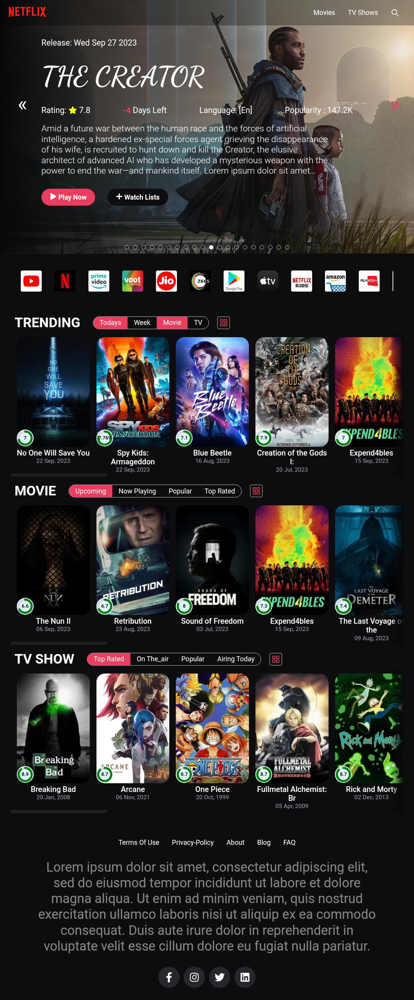
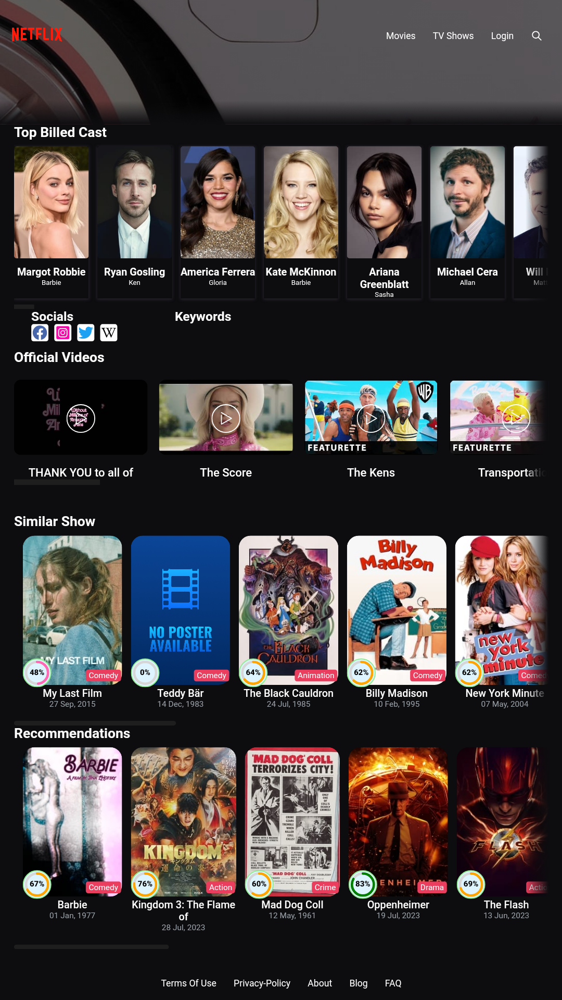
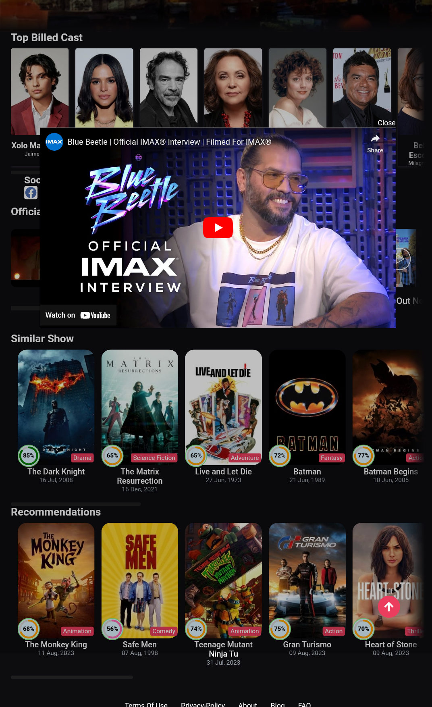
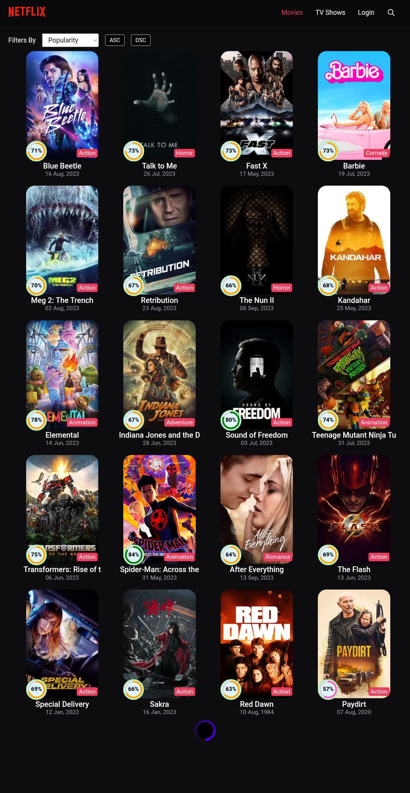
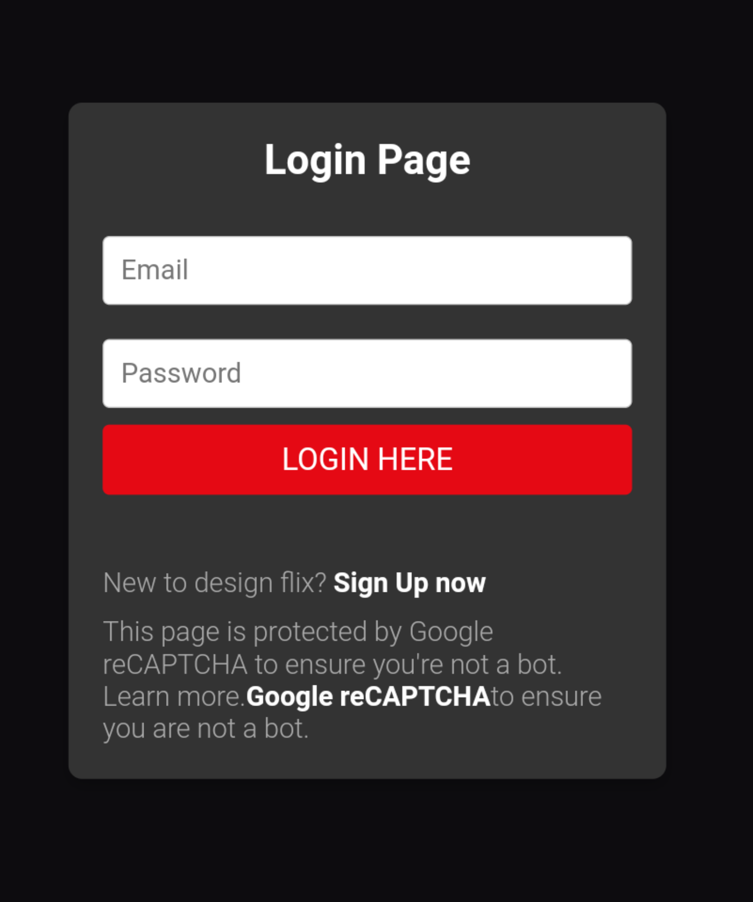

### Hosted Website Link: https://reactapp-878856.web.app

## Future Options

This project aims to create a Netflix clone, replicating some of the main features and functionalities of the popular streaming platform. Additionally, it includes several potential future options to enhance the project further. The following list outlines these future options:

1. **User Authentication**: Implement a user authentication system to allow users to create accounts, log in, and personalize their viewing experience.

2. **User Profiles**: Enable the creation of multiple user profiles within the application, allowing each user to have their own personalized recommendations, watch history, and settings.

3. **Search Functionality**: Develop a search feature that allows users to find movies and TV shows based on `search Query`.

4. **Video Player**: Build a custom video player with essential controls, including play, pause, seek, volume adjustment, and `fullScreen` mode.

5. **Responsive Design**: Ensure the application is fully responsive and optimized for different screen sizes, making it accessible and user-friendly across various devices such as desktops, tablets, and mobile phones.

6. **Movie/TV Show Details**: Implement a detailed view for each movie or TV show, displaying relevant information such as synopsis, cast, director, ratings, and reviews.

7. **More features:**: Create a system to movie and TV show provide personalized `recommendations`, play multiple videos `trailers`, `related` show or `infinity scrolling`.

Add more features in Soon...\ can you suggest the more details to please contact me in my profile [Email Link](adarshverma549@gmail.com).  

8. **WatchList**: Allow users to add movies and TV shows to a personal watchList, making it easy to save content for later viewing.

9. **Social Features**: Introduce social features such as the ability to share favorite movies or TV shows on social media platforms, as well as the option to follow and interact with other users.

10. **Payment Integration**: Integrate a payment gateway to enable subscription plans or pay-per-view options, allowing users to access premium content or unlock additional features.

11. **Continue Watching**: Implement a feature that remembers where the user left off in a movie or TV show and allows them to resume from that point seamlessly.

12. **Content Management**: Build an admin interface to manage the content, including adding, updating, and removing movies and TV shows from the application's database.
